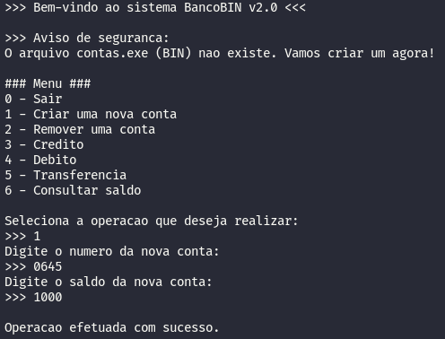
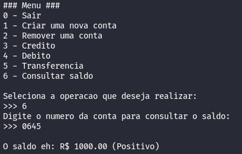
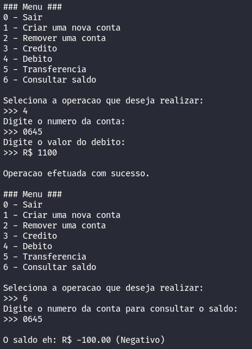

# BancoTerminal
A program that runs on terminal and simulate basic operations of a bank. Used to practice of manipulate files, functions, dictionaries and stuff.

## 📸 Screenshots

### 💵 Create account

### ⚖️ Consult Balance

### 📊 Operations
